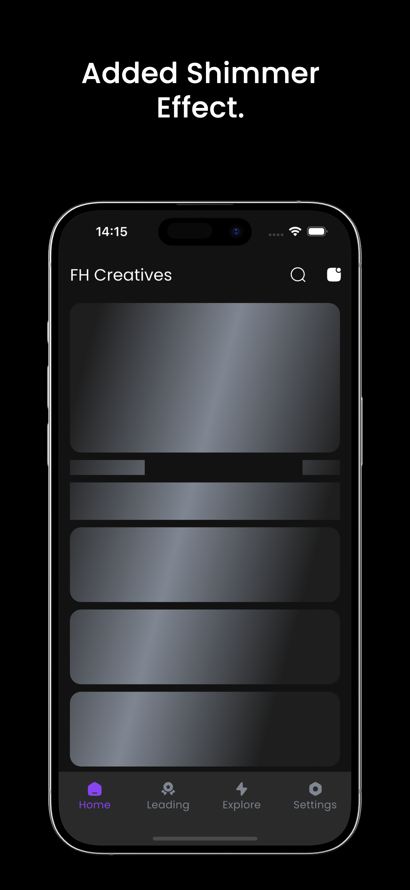
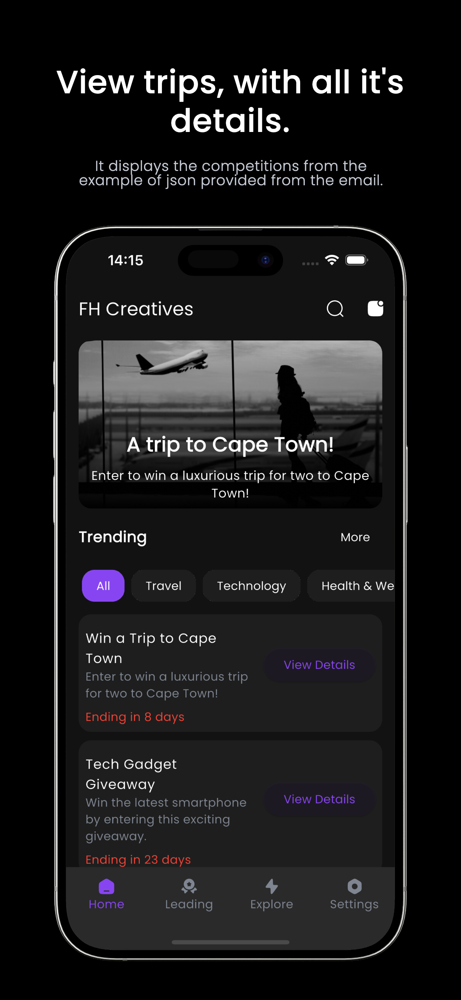
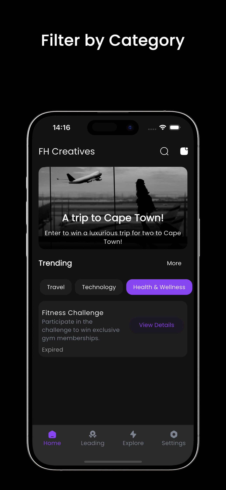

# FHC App - Flutter Prototype 🚀

Welcome to the **FHC App** prototype! This app was developed as part of a practical task for the Flutter Developer position with FHC. 🎉

### Objective 🎯

The goal of this project is to showcase key functionalities of the FHC App, which includes displaying a list of competitions and allowing users to filter them based on categories. The app also simulates entering a competition and handles expired competitions automatically.

---

### Features ✨

- **Competition List** 📋: Displays a list of competitions with details such as name, category, start date, end date, and description.
- **Category Filter** 🔍: Users can filter competitions by category, making it easier to find relevant contests.
- **Competition Details** 🏆: Each competition has a button to view its details, with a confirmation prompt for entering the competition.
- **Expired Competition Exclusion** ⏳: Competitions that have expired are automatically hidden from the list.
  
---

### Screenshots 📸

<!-- Horizontal alignment of images -->
<div style="display: flex; justify-content: space-around;">
  
  
  
</div>

---

### Tools & Technologies Used 🛠️

- **Flutter**: Used to build the cross-platform mobile app. 📱
- **Dart**: The primary programming language for Flutter. 💻
- **GetX**: For efficient state management and routing. 🔄
- **JSON**: For parsing and storing the competition data. 📊

---

### Installation ⚙️

1. **Clone the repository**:
   ```bash
   git clone https://github.com/KarlMathuthu/FHC-App-Coding-Task.git
   ```

2. **Install dependencies**:
   If you haven't already, ensure you have Flutter installed. Run the following command in the project directory:
   ```bash
   flutter pub get
   ```

3. **Run the app**:
   For mobile (Android/iOS):
   ```bash
   flutter run
   ```

---

### Approach Overview 📝

In this prototype, the main focus is on building a simple, user-friendly interface to display competitions and allow for basic interaction.

#### 1. **Competition Data** 📊
   The competition data was provided as a static list of JSON objects. Each competition includes:
   - **Name**: The name of the competition. 🎉
   - **Category**: The category under which the competition falls. 🎯
   - **Start Date & End Date**: To handle the competition's validity. ⏳
   - **Description**: A short description of the competition. 📝

#### 2. **User Interface** 💻
   The app's main screen displays a list of competitions in a scrollable view. Each competition is shown with its name, category, and a button to view more details.

   - A dropdown filter allows the user to sort competitions by category. 🔽
   - The list dynamically updates to exclude expired competitions based on the current date. 🚫

#### 3. **Enter Competition** 🎟️
   Each competition has an "Enter Competition" button. When clicked, a confirmation dialog appears, simulating an entry to the competition. ✅

---

### Future Improvements 💡

- **Data Persistence** 💾: Implement local storage or a backend API to persist user interactions and competition data.
- **Enhanced UI** 🎨: Improve the user interface with custom animations and design elements for better engagement.
- **Push Notifications** 📲: Add push notifications to alert users about new competitions or upcoming expiration dates.

---

### License 📜

This project is open-source and available under the MIT License.

---

### Contact 📧
 Made with ❤️ by https://www.github.com/KarlMathuthu